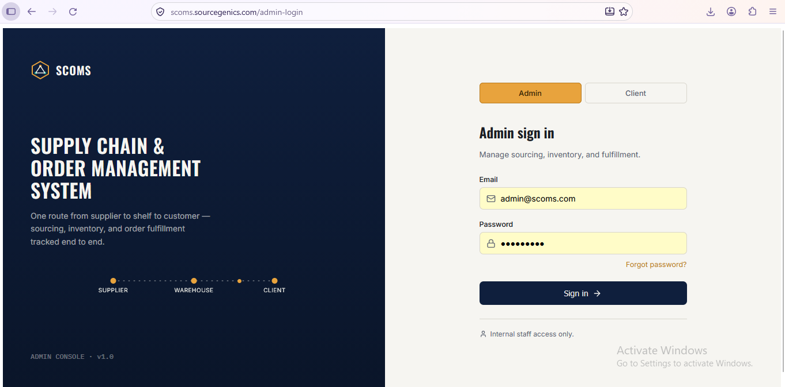
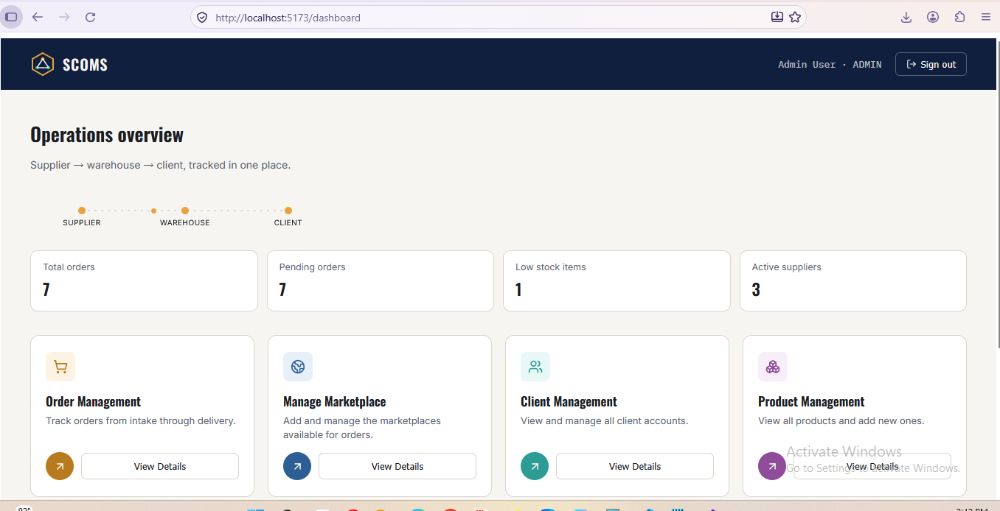
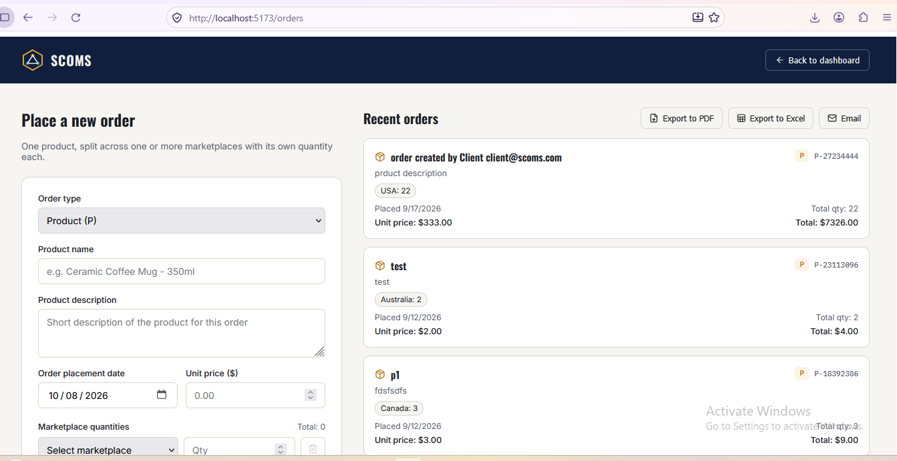

# SCOMS: Supply Chain & Order Management System

A MERN-stack web app for tracking sourcing, inventory, and order fulfilment from supplier to warehouse to client. It has separate **admin** and **client** logins, a JWT-secured REST API, and PDF and Excel exports.

## Screenshots

| Login | Admin dashboard |
|---|---|
|  |  |

**Orders with PDF / Excel export**



[Uploading page@1af95c818893ebcfc4ed9bf3b37ca3fd.webm…]()


## Features

**Admin**
- Dashboard with total orders, pending orders, low-stock items, and active suppliers
- Order management and order status updates (pending, confirmed, processing, shipped, delivered, cancelled)
- Manage Marketplace: add and manage the markets orders can be placed for (UK, USA, Australia, Canada, UAE by default)
- Client management: view all client accounts
- Product management: SKU, category, unit price, stock level, reorder point, supplier

**Client**
- Place an order for one product, split across one or more marketplaces, each with its own quantity
- Automatic total quantity and total amount
- View own orders, export them to **PDF** or **Excel**, or send them by email

## Tech stack

- **Frontend:** React 18, Vite, React Router, Axios, jsPDF + jsPDF-AutoTable, SheetJS (xlsx), Lucide icons
- **Backend:** Node.js, Express, MongoDB, Mongoose
- **Security:** JWT authentication, bcrypt password hashing, role-based access control on the server

## Project structure

```
scoms/
  client/   React + Vite frontend (login pages, dashboard, orders, products, marketplaces, clients)
  server/   Express + MongoDB API (auth, orders, suppliers, products, marketplaces, users, reports)
  docs/     Screenshots
```

## Getting started

Requires Node.js and a running MongoDB instance (local or Atlas).

**1. Server**
```
cd server
npm install
cp .env.example .env      # then edit MONGO_URI, JWT_SECRET and the seed passwords
npm run seed              # creates a sample admin and client account plus demo data
npm run dev               # API on http://localhost:5000
```

**2. Client**
```
cd client
npm install
cp .env.example .env      # VITE_API_URL, defaults to http://localhost:5000/api
npm run dev               # app on http://localhost:5173
```

Open `http://localhost:5173/admin-login` or `/client-login`. The seeded emails are `admin@scoms.com` and `client@scoms.com`; their passwords come from `SEED_ADMIN_PASSWORD` and `SEED_CLIENT_PASSWORD` in `server/.env`.

## API overview

| Method | Route | Access | Purpose |
|---|---|---|---|
| POST | /api/auth/admin-login | public | Admin sign in |
| POST | /api/auth/client-login | public | Client sign in |
| POST | /api/auth/register | public | Create an account |
| GET | /api/auth/me | authenticated | Current user |
| GET / POST | /api/orders | authenticated | List orders (clients see their own) / create an order |
| PATCH | /api/orders/:id/status | admin | Update order status |
| GET / POST / PATCH / DELETE | /api/products | admin write, all read | Manage products and inventory |
| GET / POST / PATCH / DELETE | /api/suppliers | admin | Manage suppliers |
| /api/marketplaces | | admin | Manage marketplaces |
| /api/users | | admin | Client accounts |
| GET | /api/reports/summary | admin | Dashboard summary stats |

## Status

Core order, client, product, and marketplace modules are working. The **Sourcing**, **Inventory**, and **Reporting** screens are placeholders; their API routes exist but the pages are not built yet.

## Deployment

Build the client with `npm run build` in `client/`, copy the `dist` folder into `server/public`, and run the server. One Node process then serves both the API and the frontend. Set `CLIENT_ORIGIN` and `VITE_API_URL` for your deployed addresses.
